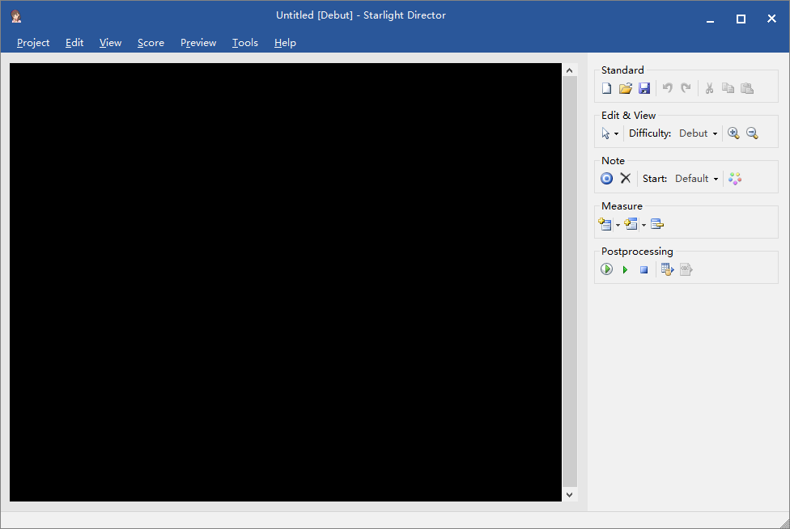

# Starlight Director

**Work In Progress**

**Downloads:**

- [Nightly Build](https://ci.appveyor.com/api/projects/hozuki/starlightdirector/artifacts/sd-latest.zip)
- [Releases](https://github.com/hozuki/StarlightDirector/releases)

For those who want to view or play the beatmaps:

- viewing: use [bmconv](https://github.com/OpenCGSS/bmconv/releases) to convert the beatmap to [Deleste](https://twitter.com/blueapple25130/status/859560616368812032) TXT format, then view in Deleste. `bmconv` is a commandline program, so please use Command Prompt to run it.
- playing: build the beatmap (BDB) and music (ACB, via [DereTore](https://github.com/OpenCGSS/DereTore)), then use IdolProxy to play it in real game.

## What is this?

The next generation of Starlight Director from [DereTore](https://github.com/OpenCGSS/DereTore). Starlight Director is the unofficial beatmap
editor for [Idolmaster Cinderella Girls Starlight Stage](http://cinderella.idolmaster.jp/sl-stage/). (Will it support Million Live Theater Days? TBD)

It is now in its beta phase. The old version is now removed.

## Requirements

- Windows 7 or later
- [.NET Framework 4.5](https://www.microsoft.com/en-us/download/details.aspx?id=42642)
- [OpenAL](https://www.openal.org/downloads/) (You can either use [OpenAL-Soft](http://kcat.strangesoft.net/openal.html), which is newer, but remember to rename the DLL name to `openal32.dll`.)
- Direct3D 11 and Direct2D

##  Usage

Experience with rhythm games is strongly recommended, so you can know whether players are able to play your beatmap or not.

[使用说明（部分完成）](src/StarlightDirector.App/Resources/Docs/Help.md)

## Building

1. Clone from GitHub: `git clone https://github.com/hozuki/StarlightDirector.git`;
2. Install missing NuGet packages: `nuget restore StarlightDirector.sln` (or use NuGet Package Manager in Visual Studio);
3. Open `StarlightDirector.sln` in Visual Studio (Visual Studio 2017 or later is required for supporting C# 7 syntax);
4. Build the solution.

## Translation

You can find language files under [`Resources/Languages`](src/StarlightDirector.App/Resources/Languages) from the application's
directory. Feel free to translate Starlight Director into your language. :D

## Screenshot

## License

MIT License. Hey logchan and stat, please add your names into the license!
